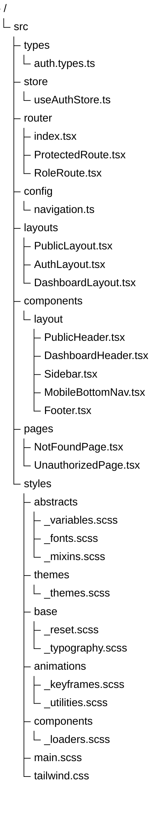

# Structure du projet

```mermaid
treeView-beta
"src"
  "types"
    "auth.types.ts"
  "store"
    "useAuthStore.ts"
  "router"
    "index.tsx"
    "ProtectedRoute.tsx"
    "RoleRoute.tsx"
  "config"
    "navigation.ts"
  "layouts"
    "PublicLayout.tsx"
    "AuthLayout.tsx"
    "DashboardLayout.tsx"
  "components"
    "layout"
      "PublicHeader.tsx"
      "DashboardHeader.tsx"
      "Sidebar.tsx"
      "MobileBottomNav.tsx"
      "Footer.tsx"
  "pages"
    "NotFoundPage.tsx"
    "UnauthorizedPage.tsx"
  "styles"
    "abstracts"
      "_variables.scss"
      "_fonts.scss"
      "_mixins.scss"
    "themes"
      "_themes.scss"
    "base"
      "_reset.scss"
      "_typography.scss"
    "animations"
      "_keyframes.scss"
      "_utilities.scss"
    "components"
      "_loaders.scss"
    "main.scss"
    "tailwind.css"
```